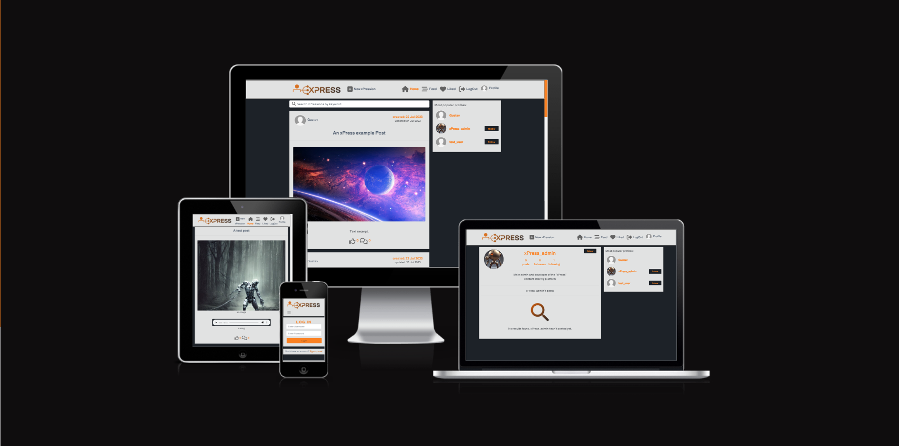

# xPress

Developer: Gustaaf Milzink

[View live website](https://xpress-react-frontend-611bb46bac21.herokuapp.com/)

## Table of Contents

1.  [About](#about)
2.  [Project Goals](#project-goals)
3.  [User Experience](#user-experience)
    1.  [Target Audience](#target-audience)
    2.  [User Requirements and Expectations](#user-requirements-and-expectations)
    3.  [User Stories](#user-stories)

## About

The xPress web app was developed to provide user's with a place to share their creativity online and react to content shared by others.

## Project Goals

The goal for this project was to build a platform where users can share and receive
feedback on their creative endevours. Users can create posts consisting of at least a title
and any or all of the following: Text(including excerpt), an image and an audiofile.

Key aspects:

*   Simple layout an intuitive navigation across all pages.
*   User authentication.
*   User interaction via likes, comments and followers.
*   User specific profiles containing: Bio, profile Avatar
*   CRUD functionality for posts, comments and profiles.
*   Filtering posts by keywords.
*   Responsive design ensuring a pleasant user experience across a range of devices.

## User Experience

### Target Audience

- People looking for a place to share their own content.
- People looking for a place to view other peoples content.
- People looking to reveive/give feedback on their/others content.

### User Requirements and Expectations

- A site which provides a level of interactivity between users.
- Links and functions should act as expected.
- Notifications to provide feedback on expected function outcomes
- Responsiveness to allow pleasant use across devices of different screen sizes.

### User Stories

1. Navigation: As a user I can view a navbar from every page, so that I can easily navigate the site.
2. Navigation: Conditional Rendering, As a logged out user I can see sign-up/sign-in options so that I can sign in/up.
3. Authentication: As a user I can create a new acccount so I can acces the features for signed up users.
4. Authentication: As a user I can sign in to the app so I can acces features for signed in users.
5. Log out of my accountAuthentication: As a user, I can log out of my account, so that I know my account is safe.
6. Authentication: Status, As a user I can tell wether I am logged in or not so I can log in if I need to.
7. Authentication: Refresh Acces Tokens, As a user I can maintain my logged in status so that my user experience is not compromised.
8. Routing: As a user I can navigate through pages quickly so I can view content without refreshing the page,
9. Avatar: As a user I can view a user's avatar so can easily identify different users.
Adding/Liking Posts:
10. Create: As a user I can create posts so that I can share my content with others.
11. Create: As a user I can post Text, Images or Audio.
12. View: As a user I can view the details of a single post so I can learn more about it.
13. Like: As a user I can like a post so I can show support for content that interests me.
Posts Listing
14. View recent posts: As a user I can view the most recent posts orderd by creation date so I can easily stay up to date with new content.
15. Search: As a user I can search for posts with keywords so I can find the posts that interest me.
16. View liked posts: As a logged in user I can view the posts I liked so I can easily find them again.
17. View posts by followed: As a logged in user I can view content filtered by users I follow so i can keep up to date with their content.
18. Infinite scroll: As a user I can keep scrolling through the posts on the site without having to click to go to the next page.
Post Detail:
19. Post Page: As a user I can view a post page so I can read comments about the post.
20. Edit Post: As a post owner I can edit a posts content so I can update after the original posting.
21. Create Comment: As a logged in user I can add comments to a post so that I can share my thoughts on the content.
22. Comment Date: As a user I can see how long ago a comment was made so I know how old it is.
23. View Comments: As a user I can read comments on a post so I can find out what others user think about the content.
24. Delete comments: As a comments owner I can delete my comment so I can control if my comment remains available online.
25. Edit Comment: As a comments owner I can edit my comment so I can update existing comments
Profile View:
26. Profile View: As a user I can view other users profiles so I can see their posts and learn more about them.
27. Most followed profiles: As a user I can see a list of the most followed profiles so that I can see wich profiles are most popular.
28. User Profile- user stats: As a user I can view statistics about  a specific user so i can learn more apout them. 
29. Follow/Unfollow: As a logged in user I can follow/unfollow other users so i can see posts by specific users in my post feed.
30. View all posts by a specific user: As a user I can view all the posts by a specific user so that I can catch up on their latest posts, or decide I want to follow them
31. Edit profile: As a logged in user I can edit my profile so that I can change my profile picture and bio
32. Update username and password: As a logged in user I can update my username and password so that I can change my display name and keep my profile secure
33. See unpublished: As a logged in user I can easily see wether a post is published or not so that know what content i have (not yet) shared with others.
34. quick publish: As a logged in user I can easily publish a draft post so that easily manage my unpublished content.

##### Back to [table of contents](#about)