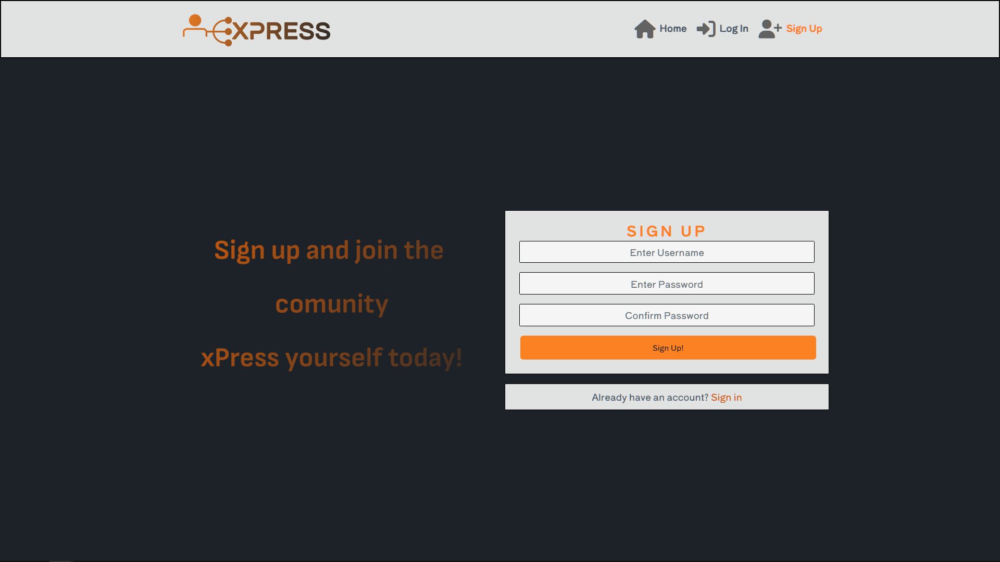

# xPress

Developer: Gustaaf Milzink

[View live website](https://xpress-react-frontend-611bb46bac21.herokuapp.com/)

## Table of Contents

1.  [About](#about)
2.  [Project Goals](#project-goals)
3.  [User Experience](#user-experience)
    1.  [Target Audience](#target-audience)
    2.  [User Requirements and Expectations](#user-requirements-and-expectations)
    3.  [User Stories](#user-stories)
4.  [Technical Design](#technical-design)
    1.  [Agile Design](#agile-design)
    2.  [CRUD Functionality](#crud-functionality)
    3.  [Colours](#colours)
    4.  [Fonts](#fonts)
    5.  [Wireframes](#wireframes)
5.  [Technologies Used](#technologies-used)
    1.  [Coding Languages](#coding-languages)
    2.  [Frameworks and Tools](#frameworks-and-tools)
    3.  [Libraries](#libraries)
6.  [Front-End](#front-end)
    1.  [React](#react)
7.  [Back-End API](#back-end-api)
    1.  [Django REST Framework](#django-rest-framework)
8.  [Features](#features)

## About

The xPress web app was developed to provide user's with a place to share their creativity online and react to content shared by others.

## Project Goals

The goal for this project was to build a platform where users can share and receive
feedback on their creative endevours. Users can create posts consisting of at least a title
and any or all of the following: Text(including excerpt), an image and an audiofile.

Key aspects:

*   Simple layout an intuitive navigation across all pages.
*   User authentication.
*   User interaction via likes, comments and followers.
*   User specific profiles containing: Bio, profile Avatar
*   CRUD functionality for posts, comments and profiles.
*   Filtering posts by keywords.
*   Responsive design ensuring a pleasant user experience across a range of devices.

## User Experience

### Target Audience

*   People looking for a place to share their own content.
*   People looking for a place to view other peoples content.
*   People looking to reveive/give feedback on their/others content.

### User Requirements and Expectations

*   A site which provides a level of interactivity between users.
*   Links and functions should act as expected.
*   Notifications to provide feedback on expected function outcomes
*   Responsiveness to allow pleasant use across devices of different screen sizes.

### User Stories

1.  Navigation: As a user I can view a navbar from every page, so that I can easily navigate the site.
2.  Navigation: Conditional Rendering, As a logged out user I can see sign-up/sign-in options so that I can sign in/up.
3.  Authentication: As a user I can create a new acccount so I can acces the features for signed up users.
4.  Authentication: As a user I can sign in to the app so I can acces features for signed in users.
5.  Log out of my accountAuthentication: As a user, I can log out of my account, so that I know my account is safe.
6.  Authentication: Status, As a user I can tell wether I am logged in or not so I can log in if I need to.
7.  Authentication: Refresh Acces Tokens, As a user I can maintain my logged in status so that my user experience is not compromised.
8.  Routing: As a user I can navigate through pages quickly so I can view content without refreshing the page,
9.  Avatar: As a user I can view a user's avatar so can easily identify different users.
    Adding/Liking Posts:
10. Create: As a user I can create posts so that I can share my content with others.
11. Create: As a user I can post Text, Images or Audio.
12. View: As a user I can view the details of a single post so I can learn more about it.
13. Like: As a user I can like a post so I can show support for content that interests me.
    Posts Listing
14. View recent posts: As a user I can view the most recent posts orderd by creation date so I can easily stay up to date with new content.
15. Search: As a user I can search for posts with keywords so I can find the posts that interest me.
16. View liked posts: As a logged in user I can view the posts I liked so I can easily find them again.
17. View posts by followed: As a logged in user I can view content filtered by users I follow so i can keep up to date with their content.
18. Infinite scroll: As a user I can keep scrolling through the posts on the site without having to click to go to the next page.
    Post Detail:
19. Post Page: As a user I can view a post page so I can read comments about the post.
20. Edit Post: As a post owner I can edit a posts content so I can update after the original posting.
21. Create Comment: As a logged in user I can add comments to a post so that I can share my thoughts on the content.
22. Comment Date: As a user I can see how long ago a comment was made so I know how old it is.
23. View Comments: As a user I can read comments on a post so I can find out what others user think about the content.
24. Delete comments: As a comments owner I can delete my comment so I can control if my comment remains available online.
25. Edit Comment: As a comments owner I can edit my comment so I can update existing comments
    Profile View:
26. Profile View: As a user I can view other users profiles so I can see their posts and learn more about them.
27. Most followed profiles: As a user I can see a list of the most followed profiles so that I can see wich profiles are most popular.
28. User Profile- user stats: As a user I can view statistics about  a specific user so i can learn more apout them.
29. Follow/Unfollow: As a logged in user I can follow/unfollow other users so i can see posts by specific users in my post feed.
30. View all posts by a specific user: As a user I can view all the posts by a specific user so that I can catch up on their latest posts, or decide I want to follow them
31. Edit profile: As a logged in user I can edit my profile so that I can change my profile picture and bio
32. Update username and password: As a logged in user I can update my username and password so that I can change my display name and keep my profile secure
33. See unpublished: As a logged in user I can easily see wether a post is published or not so that know what content i have (not yet) shared with others.
34. quick publish: As a logged in user I can easily publish a draft post so that easily manage my unpublished content.

##### Back to [table of contents](#table-of-contents)

## Technical Design

### Agile Design

An Agile approach to creating this app has been applied. GitHub's projects was used to track user stories and implement ideas based on their level of importance for allowing use of the app with no loss of functionality or user experience. Three categories were created indicating their level of importance, those were:

*   MUST HAVE
*   SHOULD HAVE
*   COULD HAVE

Github Issues and Milestones were used to define EPICS and keep track of seperate user stories contained therein giving an overview of the projects current state.

Project milestones can be found [here](https://github.com/G-Milzink/ci_pp5_xpress_react_frontend/milestones)

### CRUD Functionality

The xPress app handles data with full CRUD Functionality:  

*   Create -  Users can create, an account, profile, posts, comments, likes, and follow profiles.
*   Read - Users can view posts, comments, likes of other users and also the profiles of these users.
*   Update - Users can update their profile, password, posts, comments, likes and 'follows' through button and interactive forms.
*   Delete - Users can delete posts, comments, likes and 'follows' through interactive buttons.

### Colours

The colour scheme for this application was kept minimal  to not take atention away from use content.

Colours

### Fonts

A Google Font was implemented on the website. 'Shippori Antique B1' with a back up of sans-serif was chosen for use across the entire site.

### Wireframes

Balsamiq was used to create wireframes of the sites pages

Wireframes

##### Back to [table of contents](#table-of-contents)

## Technologies Used

### Coding Languages

*   HTML
*   CSS
*   Javascript
*   React

### Frameworks and Tools

*   [Axios](https://axios-http.com/docs/intro) - Axios is a Promise API. Justification: I used axios to send API requests from the React project to the API and avoid any CORS errors when sending cookies.

*   [JWT](https://jwt.io/) - Library to decode JSON Web token. Justification: I used JWT to securely transmit data and to have the ability to verify that the content has not been tampered with.

*   [React 17.0.2](https://17.reactjs.org/) - JavaScript library for building user interfaces. Justification: To be able to showcase my newly learnt skills and for building interactive user interfaces quickly.

*   [React-Bootstrap 1.6.7](https://react-bootstrap-v4.netlify.app/) - CSS framework. Justification: I used Bootstrap React library for UI components, styling and responsiveness.

*   [React Infinite Scroll](https://www.npmjs.com/package/react-infinite-scroll-component) - React library. Justification: I used this component to load content (tasks/comments/users) automatically as the user scrolls towards the bottom of the page without having to jump to next/previous page.

*   [React Router](https://v5.reactrouter.com/web/guides/quick-start) - Javascript framework for routing. Justification: I used this library to enable navigation between views of components and to have the ability to control what is presented to the user based on the URL they have accessed in the browser.

*   [Am I Responsive](http://ami.responsivedesign.is/) - Website responsive test site. Justification: I used this to create the multi-device mock-up at the top of this README.md file

*   [Balsamiq](https://balsamiq.com/) - Mock up software. Justification: I used this to create the projects wireframes

*   [Chrome dev tools](https://developers.google.com/web/tools/chrome-devtools/) - Developer tool. Justification: I used this for debugging of the code and checking site for responsiveness

*   [Cloudinary](https://cloudinary.com/) - File storage. Justification: I used this to store static files

*   [Font Awesome](https://fontawesome.com/) - Icon library. Justification: I used this to style the site with icons.

*   [Google Fonts](https://fonts.google.com/) - Font library. Justification: I used this to import fonts

*   [Gimp](https://www.gimp.org/) - Graphics editor. Justification: I used this to create custom graphic elements and edit images for documentation.

*   [Git](https://git-scm.com/) - Version control system. Justification: I used this for version control and to push the code to GitHub

*   [GitHub](https://github.com/) - Cloud based hosting service. Justification: I used this as a remote repository to store project code

*   [Gitpod](https://gitpod.io) - Cloud development environment. Justification: I used this to host a virtual workspace

*   Validation:

    *   [WC3 Validator](https://validator.w3.org/) - HTML Validator. Justification: I used this to validate the applications HTML code
    *   [Jigsaw W3 Validator](https://jigsaw.w3.org/css-validator/) - CSS Validator. Justification: I used this to validate the applications CSS code
    *   [ESLint](https://eslint.org/) - JavaScript Validator. Justification: I used this to validate applications JSX code
    *   [Lighthouse](https://developers.google.com/web/tools/lighthouse/) Site auditing tool. Justification: I used this to validate performance, accessibility, best practice and SEO of the application
    *   [Wave](https://wave.webaim.org/) - Site accesibility auditor. Justification: I used this to evaluate the applications accessibility

    ### Libraries

#### Installed Libraries

| Package       | Version        |
| ------------- | ------------- |
| axios |0.21.4 |
| bootstrap | 4.6.0 |
| jwt-decode | 3.1.2 |
| react-bootstrap | 1.6.3 |
| react-dom | 17.0.2 |
| react-infinite-scroll-component |6.1.0 |
| react-router-dom | 5.3.0 |
| react-scripts | 4.0.3 |
|remark|14.0.3 |
|web-vitals | 1.1.2 |

##### Back to [table of contents](#table-of-contents)

## Front-End

### React

The React.js framework is an open-source JavaScript framework and library developed for building interactive user interfaces and web applications quickly and efficiently with significantly less code than you would with vanilla JavaScript.

React was used for the following reasons:

*   Flexibility – Due to having a modular structure React code is easier to maintain compared to other front-end frameworks.
*   Speed – Creating sites/apps with React significantly increases the page loading speed as the entire page does not require to refresh and reload all components. Components are updated dynamically thus reducing the wait and load times, which affects user experience.
*   React Bootstrap - When used for styling and responsiveness React Bootstrap is a great choice as it comes with ready-to-use React built components thus taking away alot of need to create commonly used code from scratch.
*   It is the most widely used library for developing social networking and media content applications. (eg. Meta, Instagram, Netflix, AirBnB)
*   Component reusability – Components can be created and re used throughout the app with no need to re write code for the same features.

Various components were created and reused across the application:

*   `<Asset />` - Multi purpose component, used to display a range of items due to being passed props:
    A loading spinner, image with source and alt attribute or a paragraph containing a message.
*   `<AudioComponent />` - Reusable component, used to display an audio player and play back the audio component of a post.
*   `<Avatar />` - Resuable component, used to display the relevant user profile picture. This component uses props which can specify the source of the image and also its size. This allows for different sized avatars to be displayed in different sections of the app.
*   `<DropDown />` - Reusable component, used to conditionally render the three dots option button containing a dropdown menu
    with options specific to the user's logged-in status, and rights regarding the viewed content.
    (example: Users will only see the dropdown menu to edit or delete a post if they are the posts owner.)
*   `<NavBar />` - resuable component, used for easy navigation of the site. Conditionally render Icons based on the users logged-in status thus reflecting wether the user is logged in or not, the full range of app functionality becomes available only after logging in.
*   `<PageNotFound />` - Specific component, used to display a 404 page made up of an image file, a message and a link to the homepage button when the user tries to acces a non existing page.

Various pages were created and used in this application

*   auth - The auth page group consists of the following files:
    *   LoginForm.js - This file handles the Login form.
    *   SignUpForm.js - This file handles the Sign up form.

*   comments - The comments page group consists of the following files:
    *   Comment.js - This file returns the comments.
    *   CommentCreateForm.js - This file handles the create comment form.
    *   CommentEditForm.js - This file handles the Comment Edit form.

*   posts - The posts page group consists of the following files:
    *   Post.js - This file returns the posts.
    *   PostCreateForm.js - This file handles the create post form.
    *   PostEditForm.js - This file handles the post edit form.
    *   PostPage.js - This file displays a post and all it's details and content.
        (except 'excerpt' wich is only shown on PostsPage)
    *   PostsPage.js - This file displays a list of post and all their details and content.
        (except 'text' wich is only shown on PostsPage, 'excerpt' is shown here instead.)

*   profiles - The profiles page group consists of the following files:
    *   Profile.js - This file returns the profiles.
    *   ProfileEditForm.js - This file handles the profile edit form.
    *   ProfilePage.js - This file displays a profile, all it's details and a list of posts associated with the profile.
    *   PopularProfiles.js - Displays a list of the ten most popular profiles, orderd by number of followers in descending order.
    *   ChangeUserPasswordForm.js - This file handles the change user-password form.
    *   ChangeUsernameForm.js - This file handles the change username form.

### Django REST Framework

The API for this Front-End application was built with the Django REST Framework.
The repository with a README file for the DRF Back-End can be found <a href="https://github.com/G-Milzink/CI_PP5_xPress_DRF_API" target="_blank">here</a>.

##### Back to [table of contents](#table-of-contents)

## Features

In its entirety the website consists of a variety of features across the many site pages as listed below.

### Authentication

Authentication is a feature of xPress, users will have to be authenticated whilst attempting to log in or else they will not be able to use any of the sites extended functionality beyond viewing posts on the homepage.

Authentication

### Sign Up

Sign Up is a feature of xPress, it allows users to create an account and get involved in the site and use its features.

SignUp

### Log In

Log in is a feature of xPress,it allows users to log in and view content relevant to their profiles, this feature also controls security and rights of the site by requiring authentication.

LogIn

### Log Out

Log Out is a feature of xPress, it allows users the ability to log out of their profile providing a level of security if using the same device as others.

LogOut

### New xPression

New xPression is a feature of xPress, it will allow any user to create a post via the create post form.

New xPression

### Home page

Home page is a feature of xPress, it will allow any user to view a list of posts.

HomePage

### Nav Bar

Nav Bar is a feature of xPress, it allows users to navigate the site with ease while also reflecting the users logged-in status.

NavBar

### Feed

Feed is a feature of xPress, it allows users to view all posts by profiles they have followed.

Feed

### Liked

Liked is a feature of xPress, it allows users to view all posts by  they have liked.

Liked

### Profile

Profile is a feature of xPress, it allows users to a profile and all it's details and (un)published posts.
When logged out the plain profile is displayed.
When logged in and viewing another user's profile a follow/unfollow button is displayed.
When logged in and viewing a user's own profile a dropdown menu is displayed providing acces to edit/delete functionality.

Profile

### Edit Profile

Edit Profile is a feature of xPress, it allows users change their avatar and edit their bio.

Edit Profile

### Change Username

Change Username is a feature of xPress, it allows users change their username.

Change Username

Change Password is a feature of xPress, it allows users change their password.

Change Password

