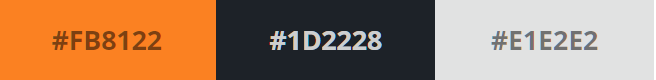
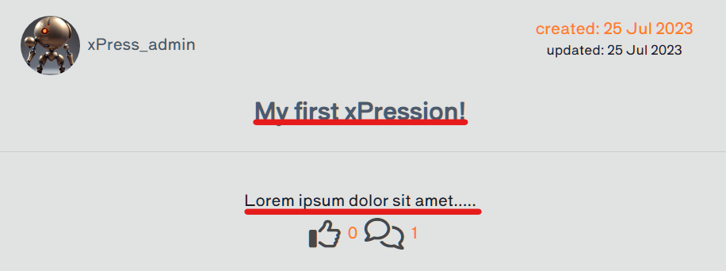
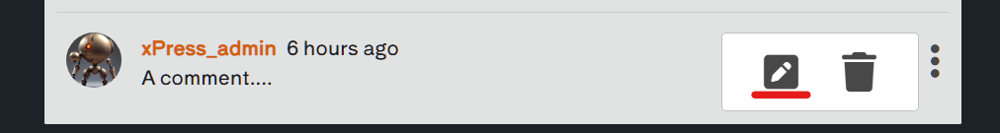
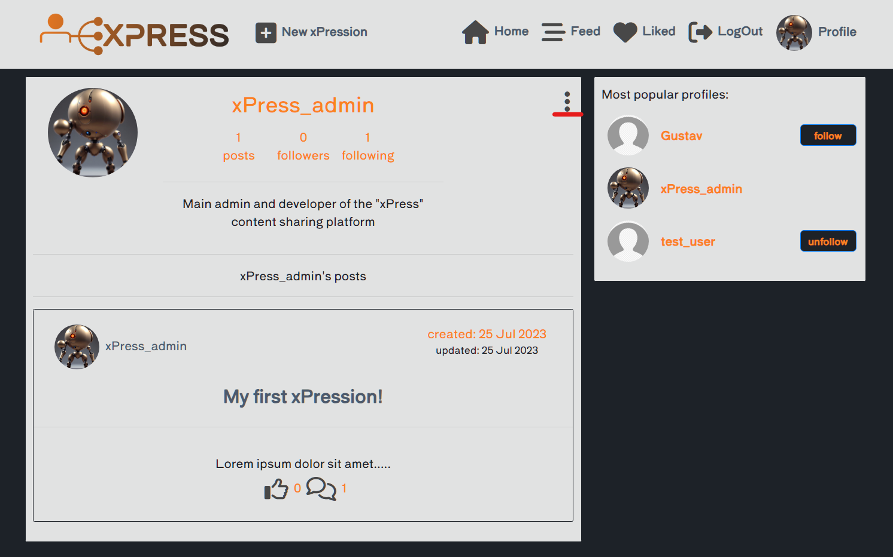
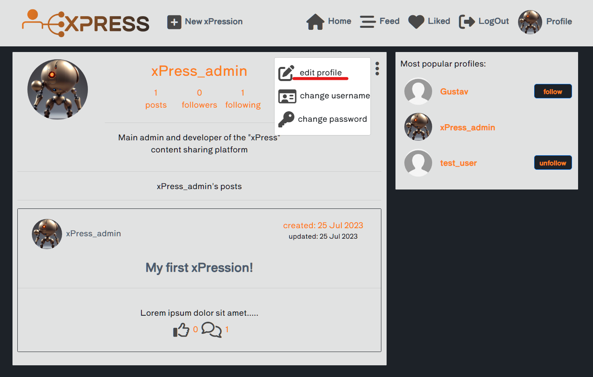
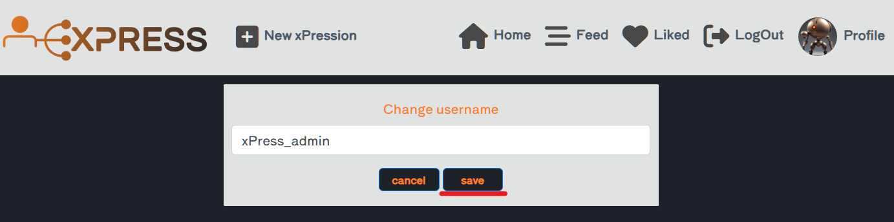

# xPress

Developer: Gustaaf Milzink

[View live website](https://xpress-frontend-3ec97631f67e.herokuapp.com/)

## Table of Contents

1.  [About](#about)
2.  [Project Goals](#project-goals)
3.  [User Experience](#user-experience)
    1.  [Target Audience](#target-audience)
    2.  [User Requirements and Expectations](#user-requirements-and-expectations)
    3.  [User Stories](#user-stories)
4.  [Technical Design](#technical-design)
    1.  [Agile Design](#agile-design)
    2.  [CRUD Functionality](#crud-functionality)
    3.  [Colours](#colours)
    4.  [Fonts](#fonts)
    5.  [Wireframes](#wireframes)
5.  [Technologies Used](#technologies-used)
    1.  [Coding Languages](#coding-languages)
    2.  [Frameworks and Tools](#frameworks-and-tools)
    3.  [Libraries](#libraries)
6.  [Front-End](#front-end)
    1.  [React](#react)
7.  [Back-End API](#back-end-api)
    1.  [Django REST Framework](#django-rest-framework)
8.  [Features](#features)
9.  [Future features / improvements](#future-features--improvements)
10. [Validation](#validation)
    1.  [HTML](#html-validation)
    2.  [CSS](#css-validation)
    3.  [ESLint JavaScript JSX Validation](#eslint-javascript-jsx-validation)
    4.  [Chrome Dev Tools Lighthouse](#chrome-dev-tools-lighthouse-validation)
    5.  [WAVE Validation](#wave-validation)
11. [Testing](#testing)
    1.  [Device Testing](#device-testing)
    2.  [Browser Compatibility](#browser-compatibility)
    3.  [Manual Testing](#manual-testing)
12. [Bugs](#bugs)
  13. [Deployment](#deployment)
      1. [Heroku](#heroku)
      2. [Forking GitHub Repo](#forking-the-github-repository)
      3. [Clone a GitHub Repo](#clone-a-github-repository)

## About

The xPress web app was developed to provide user's with a place to share their creativity online and react to content shared by others.

## Project Goals

The goal for this project was to build a platform where users can share and receive
feedback on their creative endevours. Users can create posts consisting of at least a title
and any or all of the following: Text(including excerpt), an image and an audiofile.

Key aspects:

*   Simple layout an intuitive navigation across all pages.
*   User authentication.
*   User interaction via likes, comments and followers.
*   User specific profiles containing: Bio, profile Avatar
*   CRUD functionality for posts, comments and profiles, likes and followers.
*   Filtering posts by keywords.
*   Responsive design ensuring a pleasant user experience across a range of devices.

## User Experience

### Target Audience

*   People looking for a place to share their own content.
*   People looking for a place to view other peoples content.
*   People looking to reveive/give feedback on their/others content.

### User Requirements and Expectations

*   A site which provides a level of interactivity between users.
*   Links and functions should act as expected.
*   Notifications to provide feedback on expected function outcomes
*   Responsiveness to allow pleasant use across devices of different screen sizes.

### User Stories

1.  Navigation: As a user I can view a navbar from every page, so that I can easily navigate the site.
2.  Navigation: Conditional Rendering, As a logged out user I can see sign-up/sign-in options so that I can sign in/up.
3.  Authentication: As a user I can create a new acccount so I can acces the features for signed up users.
4.  Authentication: As a user I can login in to the app so I can acces features for signed in users.
5.  Authentication: Log out of my account As a user, I can log out of my account, so that I know my account is safe.
6.  Authentication: Status, As a user I can tell wether I am logged in or not so I can log in if I need to.
7.  Authentication: Refresh Acces Tokens, As a user I can maintain my logged in status so that my user experience is not compromised.
8.  Routing: As a user I can navigate through pages quickly so I can view content without refreshing the page,
9.  Avatar: As a user I can view a user's avatar so can easily identify different users.
    Adding/Liking Posts:
10. Create: As a user I can create posts so that I can share my content with others.
11. Create: As a user I can post Text, Images or Audio.
12. Create: As a post creator I can decide wether to show all or some of the posts content so that add content to a post that I want to keep, but not yet share with the public
13. As a logged inuser I can decide wether a post is published so that create a draft post and revise it before publishing.
14. View: As a user I can view the details of a single post so I can learn more about it.
15. Like: As a user I can like a post so I can show support for content that interests me.
    Posts Listing
16. View recent posts: As a user I can view the most recent posts orderd by creation date so I can easily stay up to date with new content.
17. Search: As a user I can search for posts with keywords so I can find the posts that interest me.
18. View liked posts: As a logged in user I can view the posts I liked so I can easily find them again.
19. View posts by followed: As a logged in user I can view content filtered by users I follow so i can keep up to date with their content.
20. Infinite scroll: As a user I can keep scrolling through the posts on the site without having to click to go to the next page.
    Post Detail:
21. Post Page: As a user I can view a post page so I can read comments about the post.
22. Edit Post: As a post owner I can edit a posts content so I can update after the original posting.
23. Create Comment: As a logged in user I can add comments to a post so that I can share my thoughts on the content.
24. Comment Date: As a user I can see how long ago a comment was made so I know how old it is.
25. View Comments: As a user I can read comments on a post so I can find out what others user think about the content.
26. Delete comments: As a comments owner I can delete my comment so I can control if my comment remains available online.
27. Edit Comment: As a comments owner I can edit my comment so I can update existing comments
    Profile View:
28. Profile View: As a user I can view other users profiles so I can see their posts and learn more about them.
29. Most followed profiles: As a user I can see a list of the most followed profiles so that I can see wich profiles are most popular.
30. User Profile- user stats: As a user I can view statistics about  a specific user so i can learn more apout them.
31. Follow/Unfollow: As a logged in user I can follow/unfollow other users so i can see posts by specific users in my post feed.
32. View all posts by a specific user: As a user I can view all the posts by a specific user so that I can catch up on their latest posts, or decide I want to follow them
33. Edit profile: As a logged in user I can edit my profile so that I can change my profile picture and bio
34. Update username and password: As a logged in user I can update my username and password so that I can change my display name and keep my profile secure
35. See unpublished: As a logged in user I can easily see wether a post is published or not so that know what content i have (not yet) shared with others.
36. quick publish: As a logged in user I can easily publish a draft post so that easily manage my unpublished content.

##### Back to [table of contents](#table-of-contents)

## Technical Design

### Agile Design

An Agile approach was used dureing development of this app. GitHub's projects was used to track user stories and implement ideas based on their level of importance for allowing use of the app with no loss of functionality or user experience. Three categories were created indicating their level of importance, those were:

MUST HAVE
SHOULD HAVE
COULD HAVE

Github project be found [here](https://github.com/G-Milzink/ci_pp5_xpress_react_frontend/projects?query=is%3Aopen)

### CRUD Functionality

The xPress app handles data with full CRUD Functionality:  

*   Create -  Users can create, an account, profile, posts, comments, likes, and follow profiles.
*   Read - Users can view posts, comments, likes of other users and also the profiles of these users.
*   Update - Users can update their profile, password, posts, comments, likes and 'follows' through button and interactive forms.
*   Delete - Users can delete posts, comments, likes and 'follows' through interactive buttons.

### Colours

The colour scheme for this application was kept minimal  to not take atention away from user content while
maintaining proper contrast to assure legibility.

Colours

### Fonts

A Google Font was implemented on the website. 'Shippori Antique B1' with a back up of sans-serif was chosen for use across the entire site.

### Wireframes

Balsamiq was used to create wireframes of the sites pages

Wireframes

Home(not logged in)
 
 

Home(logged in)
 

Signup
 
 

Login
 
  

New Post
 
  

Edit Post
 

Feed
 
 

Liked
 

Profile
 
 

Edit Profile
 
  

Change Password
 
 

Change Username
 
 

##### Back to [table of contents](#table-of-contents)

## Technologies Used

### Coding Languages

*   HTML
*   CSS
*   Javascript
*   React

### Frameworks and Tools

*   [Axios](https://axios-http.com/docs/intro) - Axios is a Promise API. Justification: I used axios to send API requests from the React project to the API and avoid any CORS errors when sending cookies.

*   [JWT](https://jwt.io/) - Library to decode JSON Web token. Justification: I used JWT to securely transmit data and to have the ability to verify that the content has not been tampered with.

*   [React 17.0.2](https://17.reactjs.org/) - JavaScript library for building user interfaces. Justification: To be able to showcase my newly learnt skills and for building interactive user interfaces quickly.

*   [React-Bootstrap 1.6.7](https://react-bootstrap-v4.netlify.app/) - CSS framework. Justification: I used Bootstrap React library for UI components, styling and responsiveness.

*   [React Infinite Scroll](https://www.npmjs.com/package/react-infinite-scroll-component) - React library. Justification: I used this component to load content (tasks/comments/users) automatically as the user scrolls towards the bottom of the page without having to jump to next/previous page.

*   [React Router](https://v5.reactrouter.com/web/guides/quick-start) - Javascript framework for routing. Justification: I used this library to enable navigation between views of components and to have the ability to control what is presented to the user based on the URL they have accessed in the browser.

*   [Am I Responsive](http://ami.responsivedesign.is/) - Website responsive test site. Justification: I used this to create the multi-device mock-up at the top of this README.md file

*   [Balsamiq](https://balsamiq.com/) - Mock up software. Justification: I used this to create the projects wireframes

*   [Chrome dev tools](https://developers.google.com/web/tools/chrome-devtools/) - Developer tool. Justification: I used this for debugging of the code and checking site for responsiveness

*   [Cloudinary](https://cloudinary.com/) - File storage. Justification: I used this to store static files

*   [Font Awesome](https://fontawesome.com/) - Icon library. Justification: I used this to style the site with icons.

*   [Google Fonts](https://fonts.google.com/) - Font library. Justification: I used this to import fonts

*   [Gimp](https://www.gimp.org/) - Graphics editor. Justification: I used this to create custom graphic elements and edit images for documentation.

*   [Git](https://git-scm.com/) - Version control system. Justification: I used this for version control and to push the code to GitHub

*   [GitHub](https://github.com/) - Cloud based hosting service. Justification: I used this as a remote repository to store project code

*   [Gitpod](https://gitpod.io) - Cloud development environment. Justification: I used this to host a virtual workspace

*   Validation:

    *   [WC3 Validator](https://validator.w3.org/) - HTML Validator. Justification: I used this to validate the applications HTML code
    *   [Jigsaw W3 Validator](https://jigsaw.w3.org/css-validator/) - CSS Validator. Justification: I used this to validate the applications CSS code
    *   [ESLint](https://eslint.org/) - JavaScript Validator. Justification: I used this to validate applications JSX code
    *   [Lighthouse](https://developers.google.com/web/tools/lighthouse/) Site auditing tool. Justification: I used this to validate performance, accessibility, best practice and SEO of the application
    *   [Wave](https://wave.webaim.org/) - Site accesibility auditor. Justification: I used this to evaluate the applications accessibility

    ### Libraries

#### Installed Libraries

| Package       | Version        |
| ------------- | ------------- |
| axios |0.21.4 |
| bootstrap | 4.6.0 |
| jwt-decode | 3.1.2 |
| react-bootstrap | 1.6.3 |
| react-dom | 17.0.2 |
| react-infinite-scroll-component |6.1.0 |
| react-router-dom | 5.3.0 |
| react-scripts | 4.0.3 |
|remark|14.0.3 |
|web-vitals | 1.1.2 |

##### Back to [table of contents](#table-of-contents)

## Front-End

### React

The React.js framework is an open-source JavaScript framework and library developed for building interactive user interfaces and web applications quickly and efficiently with significantly less code than you would with vanilla JavaScript.

React was used for the following reasons:

*   Flexibility – Due to having a modular structure React code is easier to maintain compared to other front-end frameworks.
*   Speed – Creating sites/apps with React significantly increases the page loading speed as the entire page does not require to refresh and reload all components. Components are updated dynamically thus reducing the wait and load times, which affects user experience.
*   React Bootstrap - When used for styling and responsiveness React Bootstrap is a great choice as it comes with ready-to-use React built components thus taking away alot of need to create commonly used code from scratch.
*   It is the most widely used library for developing social networking and media content applications. (eg. Meta, Instagram, Netflix, AirBnB)
*   Component reusability – Components can be created and re used throughout the app with no need to re write code for the same features.

Various components were created and reused across the application:

*   `<Asset />` - Multi purpose component, used to display a range of items due to being passed props:
    A loading spinner, image with source and alt attribute or a paragraph containing a message.
    *   Used in user story: 

*   `<AudioComponent />` - Reusable component, used to display an audio player and play back the audio component of a post.
    * Used in user story: 10, 11, 12, 14, 22.

*   `<Avatar />` - Resuable component, used to display the relevant user profile picture. This component uses props which can specify the source of the image and also its size. This allows for different sized avatars to be displayed in different sections of the app.
* Used in user story: 2, 3, 9, 28, 29, 30.

*   `<DropDown />` - Reusable component, used to conditionally render the three dots option button containing a dropdown menu
    with options specific to the user's logged-in status, and rights regarding the viewed content.
    (example: Users will only see the dropdown menu to edit or delete a post if they are the posts owner.)
    *  Used in user story: 22, 26, 27, 33, 34, 

*   `<NavBar />` - resuable component, used for easy navigation of the site. Conditionally render Icons based on the users logged-in status thus reflecting wether the user is logged in or not, the full range of app functionality becomes available only after logging in.
    *  Used in user story: 1, 2, 3, 5, 6, 8, , 10

*   `<PageNotFound />` - Specific component, used to display a 404 page made up of an image file, a message and a link to the homepage button when the user tries to acces a non existing page.

Various pages were created and used in this application

*   auth - The auth page group consists of the following files:
    *   LoginForm.js - This file handles the Login form.
    *   SignUpForm.js - This file handles the Sign up form.

*   comments - The comments page group consists of the following files:
    *   Comment.js - This file returns the comments.
    *   CommentCreateForm.js - This file handles the create comment form.
    *   CommentEditForm.js - This file handles the Comment Edit form.

*   posts - The posts page group consists of the following files:
    *   Post.js - This file returns the posts.
    *   PostCreateForm.js - This file handles the create post form.
    *   PostEditForm.js - This file handles the post edit form.
    *   PostPage.js - This file displays a post and all it's details and content.
        (except 'excerpt' wich is only shown on PostsPage)
    *   PostsPage.js - This file displays a list of post and all their details and content.
        (except 'text' wich is only shown on PostsPage, 'excerpt' is shown here instead.)

*   profiles - The profiles page group consists of the following files:
    *   Profile.js - This file returns the profiles.
    *   ProfileEditForm.js - This file handles the profile edit form.
    *   ProfilePage.js - This file displays a profile, all it's details and a list of posts associated with the profile.
    *   PopularProfiles.js - Displays a list of the ten most popular profiles, orderd by number of followers in descending order.
    *   ChangeUserPasswordForm.js - This file handles the change user-password form.
    *   ChangeUsernameForm.js - This file handles the change username form.

### Django REST Framework

The API for this Front-End application was built with the Django REST Framework.
The repository with a README file for the DRF Back-End can be found <a href="https://github.com/G-Milzink/CI_PP5_xPress_DRF_API" target="_blank">here</a>.

##### Back to [table of contents](#table-of-contents)

## Features

In its entirety the website consists of a variety of features across the many site pages as listed below.

### Authentication

Authentication is a feature of xPress, users will have to be authenticated whilst attempting to log in or else they will not be able to use any of the sites extended functionality beyond viewing posts on the homepage.

Authentication

### Nav Bar

Nav Bar is a feature of xPress, it allows users to navigate the site with ease while also reflecting the users logged-in status.

NavBar

### Sign Up

Sign Up is a feature of xPress, it allows users to create an account and get involved in the site and use its features.

SignUp

### Log In

Log in is a feature of xPress,it allows users to log in and view content relevant to their profiles, this feature also controls security and rights of the site by requiring authentication.

LogIn

### Log Out

Log Out is a feature of xPress, it allows users the ability to log out of their profile providing a level of security if using the same device as others.

LogOut

### New xPression

New xPression is a feature of xPress, it will allow any user to create a post via the create post form.

New xPression

### Home page

Home page is a feature of xPress, it will allow any user to view a list of posts.

HomePage

### Feed

Feed is a feature of xPress, it allows users to view all posts by profiles they have followed.

Feed

### Liked

Liked is a feature of xPress, it allows users to view all posts by  they have liked.

Liked

### Profile

Profile is a feature of xPress, it allows users to a profile and all it's details and (un)published posts.
When logged out the plain profile is displayed.
When logged in and viewing another user's profile a follow/unfollow button is displayed.
When logged in and viewing a user's own profile a dropdown menu is displayed providing acces to edit/delete functionality.

Profile

### Edit Profile

Edit Profile is a feature of xPress, it allows users change their avatar and edit their bio.

Edit Profile

### Change Username

Change Username is a feature of xPress, it allows users change their username.

Change Username

### Change Password

Change Password is a feature of xPress, it allows users change their password.

Change Password

### Comment

Comment is a feature of xPress, it allows logged-in users to comment on posts.

Comment

### Edit Comment

Edit Comment is a feature of xPress, it allows logged-in users to edit their comments.

Edit Comment

### Delete Comment

Delete Comment is a feature of xPress, it allows logged-in users to delete their comments.

Delete Comment

### Like

Like is a feature of xPress, it allows logged-in users to like/unlike a post.

Like

### Follow

Follow is a feature of xPress, it allows logged-in users to follow/unfollow a profile.

Follow

### Search

Search is a feature of xPress, it allows users to search a list of posts by keyword.
Search is available for the 'Home', 'Feed' and 'Liked' pages.

Search

### Input Validation

Input Validation is a feature of the xPress It used throughout the site for form inputs.

Input Validation image

## Future features / improvements

Due to time constraints there is still room for refactoring of code and additional functionality / features to implement to the site.

*   File transformation on upload/retreival.
    * Adjust file format for user submitted media (images/audio) automatically on upload to Cloudinary
    to improve site performance.
*   Password recovery
    *   Forgotten password option to recover access to the account using a one time link via email
*   Account creation via socials
    *   Allow user authentication with already existing accounts, e.g. LinkedIn, Google, etc.

##### Back to [table of contents](#table-of-contents)

## Validation

### HTML Validation

The W3C Markup Validation Service was used to validate the HTML of the website. No errors were identified.

Home(not logged in)
 
 

Home(logged in)
 
 

Signup
 
 

Login
 
 

New Post
 
 

Edit Post
 
 

Feed
 
 

Liked
 
 

Profile
 
 

Edit Profile
 
 

Post
 
 

Edit Post
 
 

Change Password
 
 

Change Username
 
 

### CSS Validation

The W3C Jigsaw CSS Validation Service was used to validate the CSS of the website.
All CSS modules pass the validation with no errors.

Index.css
 
 

 

App.module.css
 
 

Asset.module.css
 
 

AudioComponent.module.css
 
 

Avatar.module.css
 
 

Button.module.css
 
 

Comment.module.css
 
 

CommentCreateEditForm.module.css
 
 

Dropdown.module.css
 
 

NavBar.module.css
 
 

PageNotFound.module.css
 
 

Post.module.css
 
 

PostCreateEditForm.module.css
 
 

PostPage.module.css
 
 

Profile.module.css
 
 

ProfilePage.module.css
 
 

SignUpLogInForm.module.css
 
 

### ESLint JavaScript JSX Validation

All JavaScript files were validated using ESLint JavaScript validator.
All files passed without warings or errors.

JavaScript

 

### Chrome Dev Tools Lighthouse Validation

Lighthouse was used to test the performance, accessibility, best practice and SEO of the site.
The validation was done for  mobile.

- Currently site performance is sub-optimal as user submitted content
(images/video) is uploaded to Cloudinary as is. Performace can potentialy be improved by implementing
file transformation, either in the API code or through CLoudinary settings.

Results

home
 
 

feed
 
 

liked
 
 

profile
 
 

create post
 
 

edit post
 
 

### Wave Validation

The WAVE WebAIM web accessibility evaluation tool was used to test the websites accessibility.
All pages passed with 0 errors.

Results
 

homepage logged out

 

homepage_logged in

 

signup

 

login

 

create post

 

edit post

 

profile

 

edit profile

 

feed

 

liked

 

change password

 

change username

 

##### Back to [table of contents](#table-of-contents)

## Testing

### Device Testing

This site was tested on the following devices:

*   Windows PC with 27" monitor.
*   Samsung Galaxy A01.
*   Chrome Dev Tools were used to test for a range of screen sizes.

### Browser compatibility

The website was tested on the following web browsers:

*   Google Chrome
*   FireFox
*   Microsoft Edge

### Manual testing

See Testing User Stories

#### Testing User Stories - Users

1.  Navigation: As a user I can view a navbar from every page, so that I can easily navigate the site.

| Feature       | Action        | Expected Result  | Actual Result |
| ------------- | ------------- | -------------    | ------------- |
| Navbar | Locate Navbar at top of page, Click apropriate link | Direct user to selected page | Works as expected |
| Burger Menu | Visit site on mobile, Find burger menu with links | Direct user to selected page | Works as expected |

Screenshots

2.  Navigation: Conditional Rendering, As a logged out user I can see sign-up/sign-in options so that I can sign in/up

| Feature       | Action        | Expected Result  | Actual Result |
| ------------- | ------------- | -------------    | ------------- |
|NavBar | Locate navbar | Find Signup/Login links | Works as expected |

Screenshots

3.  Authentication: As a user I can create a new acccount so I can acces the features for signed up users.

| Feature       | Action        | Expected Result  | Actual Result |
| ------------- | ------------- | -------------    | ------------- |
| Signup Page | Click Signup link | Find SignUp form | Works as expected |

Screenshots

4.  Authentication: As a user I can login in to the app so I can acces features for logged in users.

| Feature       | Action        | Expected Result  | Actual Result |
| ------------- | ------------- | -------------    | ------------- |
| Login Page | Click Login link | Find Login form | Works as expected |

Screenshots

5.  Authentication: As a user, I can log out of my account, so that I know my account is safe.

| Feature       | Action        | Expected Result  | Actual Result |
| ------------- | ------------- | -------------    | ------------- |
| Navbar | Click Logout link | User is logged out | Works as expected |

Screenshots

6.  Authentication: Status, As a user I can tell wether I am logged in or not so I can log in if I need to.

| Feature       | Action        | Expected Result  | Actual Result |
| ------------- | ------------- | -------------    | ------------- |
| Navbar | Locate navbar | See logged in/out status reflected in icons | Works as expected |

Screenshots

7.  Authentication: Refresh Acces Tokens, As a user I can maintain my logged in status so that my user experience is not compromised.

| Feature       | Action        | Expected Result  | Actual Result |
| ------------- | ------------- | -------------    | ------------- |
| JWT  | Return to site within 24h without loggin out | Logged in status is maintained | Works as expected |

8.  Routing: As a user I can navigate through pages quickly so I can view content without refreshing the page.

| Feature       | Action        | Expected Result  | Actual Result |
| ------------- | ------------- | -------------    | ------------- |
| Site navigation | Visit several pages on site | Content loads without page refresh | Works as expected |

9.  Avatar: As a user I can view a user's avatar so can easily identify different users.

| Feature       | Action        | Expected Result  | Actual Result |
| ------------- | ------------- | -------------    | ------------- |
| Avatar | View user's content | Find avatar | Works as expected |

Screenshots

10. Create: As a user I can create posts so that I can share my content with others.

| Feature       | Action        | Expected Result  | Actual Result |
| ------------- | ------------- | -------------    | ------------- |
| Navbar | click 'new xPression link' | Find post creation form | Works as expected |

Screenshots

11. Create: As a user I can post Text, Images or Audio.

| Feature       | Action        | Expected Result  | Actual Result |
| ------------- | ------------- | -------------    | ------------- |
| Create Post Form | Visit post creation form | Find options for content types | Works as expected |

Screenshots

12. Create: As a post creator I can decide wether to show all or some of the posts content so that add content to a post that I want to keep, but not yet share with the public

| Feature       | Action        | Expected Result  | Actual Result |
| ------------- | ------------- | -------------    | ------------- |
| Create Post Form | Visit post creation form | Find options for content inclusion | Works as expected |

Screenshots

13. Create: As a logged inuser I can decide wether a post is published so that create a draft post and revise it before publishing.

| Feature       | Action        | Expected Result  | Actual Result |
| ------------- | ------------- | -------------    | ------------- |
| Create Post Form | Visit post creation form | Find option for post publication | Works as expected |

Screenshots

14. View: As a user I can view the details of a single post so I can learn more about it.

| Feature       | Action        | Expected Result  | Actual Result |
| ------------- | ------------- | -------------    | ------------- |
| Post page | Click a post | User is redirected to post Detail page | Works as expected |

Screenshots

15. Like: As a user I can like a post so I can show support for content that interests me.
    Posts Listing

| Feature       | Action        | Expected Result  | Actual Result |
| ------------- | ------------- | -------------    | ------------- |
| Post | Click like icon | post is liked/unliked | Works as expected |

Screenshots

16. View recent posts: As a user I can view the most recent posts orderd by creation/update date so I can easily stay up to date with new content.

| Feature       | Action        | Expected Result  | Actual Result |
| ------------- | ------------- | -------------    | ------------- |
| HomePage | Visit Site | Find ordered list of posts | Works as expected |

Screenshots

17. Search: As a user I can search for posts with keywords so I can find the posts that interest me.

| Feature       | Action        | Expected Result  | Actual Result |
| ------------- | ------------- | -------------    | ------------- |
| Search bar | Type keywords | See filtered list of posts | Works as expected |

Screenshots

18. View liked posts: As a logged in user I can view the posts I liked so I can easily find them again.

| Feature       | Action        | Expected Result  | Actual Result |
| ------------- | ------------- | -------------    | ------------- |
| Liked page | Visit liked page | view list of liked posts | Works as expected |

Screenshots

19. View posts by followed: As a logged in user I can view content filtered by users I follow so i can keep up to date with their content.

| Feature       | Action        | Expected Result  | Actual Result |
| ------------- | ------------- | -------------    | ------------- |
| Feed page | Visit feed page | view list of posts by followed users | Works as expected |

Screenshots

20. Infinite scroll: As a user I can keep scrolling through the posts on the site without having to click to go to the next page.

| Feature       | Action        | Expected Result  | Actual Result |
| ------------- | ------------- | -------------    | ------------- |
| Infinite scroll | scroll to bottom of postlist | more ccontent is loaded | Works as expected |

21. Post Page: As a user I can view a post page so I can read comments about the post.

| Feature       | Action        | Expected Result  | Actual Result |
| ------------- | ------------- | -------------    | ------------- |
|Post page | Visit specific post | Find comment section | Works as expected |

Screenshots

22. Edit Post: As a post owner I can edit a posts content so I can update after the original posting.

| Feature       | Action        | Expected Result  | Actual Result |
| ------------- | ------------- | -------------    | ------------- |
|Edit post form | Clickc edit post link | Find post edit form | Works as expected |

Screenshots

23. Create Comment: As a logged in user I can add comments to a post so that I can share my thoughts on the content.

| Feature       | Action        | Expected Result  | Actual Result |
| ------------- | ------------- | -------------    | ------------- |
|Comment | Visit comment section | Find create comment form | Works as expected |

Screenshots

24. Comment Date: As a user I can see how long ago a comment was made so I know how old it is.

| Feature       | Action        | Expected Result  | Actual Result |
| ------------- | ------------- | -------------    | ------------- |
|Post page | Visit specific post | Find comment section | Works as expected |

Screenshots

25. View Comments: As a user I can read comments on a post so I can find out what others user think about the content.

| Feature       | Action        | Expected Result  | Actual Result |
| ------------- | ------------- | -------------    | ------------- |
|Comment | Visit specific post | Find comment section | Works as expected |

Screenshots

26. Delete comments: As a comments owner I can delete my comment so I can control if my comment remains available online.

| Feature       | Action        | Expected Result  | Actual Result |
| ------------- | ------------- | -------------    | ------------- |
|Comment | view owned comment | Find dropdown menu, select delete | Works as expected |

Screenshots

27. Edit Comment: As a comments owner I can edit my comment so I can update existing comments.

| Feature       | Action        | Expected Result  | Actual Result |
| ------------- | ------------- | -------------    | ------------- |
|Comment | view owned comment | Find dropdown menu, select edit | Works as expected |

Screenshots

28. Profile View: As a user I can view other users profiles so I can see their posts and learn more about them.

| Feature       | Action        | Expected Result  | Actual Result |
| ------------- | ------------- | -------------    | ------------- |
|Profile page | Click other users avatar | Find other users profile page | Works as expected |

Screenshots

29. Most followed profiles: As a user I can see a list of the most followed profiles so that I can see wich profiles are most popular.

| Feature       | Action        | Expected Result  | Actual Result |
| ------------- | ------------- | -------------    | ------------- |
| Popular Profiles List | Visit any page | Find list of poular profiles| Works as expected |

Screenshots

30. User Profile- user stats: As a user I can view statistics about  a specific user so i can learn more apout them.

| Feature       | Action        | Expected Result  | Actual Result |
| ------------- | ------------- | -------------    | ------------- |
|Profile page | Visit user's profile page | Find profile statisticcs and bio | Works as expected |

Screenshots

31. Follow/Unfollow: As a logged in user I can follow/unfollow other users so i can see posts by specific users in my post feed.

| Feature       | Action        | Expected Result  | Actual Result |
| ------------- | ------------- | -------------    | ------------- |
| Follow | View other user's profile | Find Follow/UnFollow button| Works as expected |
|Follow | Viewe popular profiles list | Find Follow/UnFollow button| Works as expected |

Screenshots

32. View all posts by a specific user: As a user I can view all the posts by a specific user so that I can catch up on their latest posts, or decide I want to follow them

| Feature       | Action        | Expected Result  | Actual Result |
| ------------- | ------------- | -------------    | ------------- |
| Profile page | Visit other user's profile | Find other all the user's published posts| Works as expected |

Screenshots

33. Edit profile: As a logged in user I can edit my profile so that I can change my profile picture and bio

| Feature       | Action        | Expected Result  | Actual Result |
| ------------- | ------------- | -------------    | ------------- |
|Profile page | View own profile, select edit from dropdown menu | Find Profile edit form | Works as expected |
|Profile Edit Form | Enter new info/change image and submit | Profile is updated | Works as expected |

Screenshots

34. Update username and password: As a logged in user I can update my username and password so that I can change my display name and keep my profile secure

| Feature       | Action        | Expected Result  | Actual Result |
| ------------- | ------------- | -------------    | ------------- |
|Profile page | View own profile, select apropriate option from dropdown menu | Find relevant form | Works as expected |
|Change username | Enter new username and submit | username is updated | Works as expected |
|Change password | Enter new password and submit | password is updated | Works as expected |

Screenshots

35. See unpublished: As a logged in user I can easily see wether a post is published or not so that know what content i have (not yet) shared with others.

| Feature       | Action        | Expected Result  | Actual Result |
| ------------- | ------------- | -------------    | ------------- |
| Profile page | Visit own profile | See 'unpublished' notification on unpublished posts | Works as expected |
| Post page | Visit own profile | See 'unpublished' notification on unpublished posts | Works as expected |

Screenshots

36. quick publish: As a logged in user I can easily publish a draft post so that easily manage my unpublished content.

| Feature       | Action        | Expected Result  | Actual Result |
| ------------- | ------------- | -------------    | ------------- |
| Profile page | Visit own profile | See Publish button on unpublished posts | Works as expected |
| Post page | Visit own profile | See Publish button on unpublished posts | Works as expected |

Screenshots

##### Back to [table of contents](#table-of-contents)

## Bugs

| **Bug** | **Cause** | **Fix** | **Status** |
| ------- | ------- | ------- | ------ |
| Liked page will not retreive any posts| Iconsistency in filter fieldset value and database 'Like' database model |Reviewed API for errors in 'Like' Database Model | resolved |
| Edit profile form will not submit | Profile model 'name' field is required yet remains empty on profile creation | Automatically populate 'name' key with value from 'owner' key on form submission if 'name' key is empty| resolved |

## Deployment

### Heroku

This project was deployed to [Heroku](https://www.heroku.com) in the project's early stages to allow continual responsive testing. This was achieved via the following steps:

The website was deployed with Heroku by following these steps:

1. Use the "pip freeze -> requiremnts.txt" command in the terminal to save any libraries that need to be installed in the file.
2. The app uses Cloudinary to host the post images therefore a Cloudinary account will be required. 
3. Log in to [Cloudinary](https://cloudinary.com/) or create an account for free.
4. Navigate to the Dashboard on Cloudinary

Screenshot

5. Copy and store the value of the 'API Environment Variable" beginning at cloudinary:// until the end, this will be used in the Heroku Config Vars. 
6. The app also uses ElephantSQL to host the database
7. Log in to [ElephantSQL](https://www.elephantsql.com/) or create an account for free.
8. Click on Create a new instance

Screenshot

9. Set up your plan. Give the 'plan' the desired name, select the Tiny Turtle (free) plan and leave tags blank.

Screenshot

10. Select the region and choose the nearest data centre to your location.

Screenshot

11. Click 'review' and if happy with the details presented click on the create instance button.

Screenshot

12. From the instances section click on the instance with the name that was just created.
13. Get the ElephantSQL database URL from the instance details page and copy, this will be used in the Heroku Config Vars

Screenshot

14. Navigate to https://www.heroku.com/ and login or create an account. 
15. Click the "new" button in the upper right corner and select "create new app".

Screenshot

16. Choose an app name and your region and click "Create app".

Screenshot

17. Go to the "deploy" tab and pick GitHub as a deployment method.
18. Search for a repository to connect to and select the branch you would like to build the app from.
19. If preferred, enable automatic deploys and then deploy branch.
20. Wait for the app to build and then click on the "View" link which will redirect you to the deployed link.

### Forking the GitHub Repository

We can make a copy of the original repository on our GitHub account to view or make changes too without affecting the original repository, this is known as forking. Forking in GitHub can be done via the following steps:

1. Navigate to www.github.com and log in.
2. Once logged in navigate to the desired [GitHub Repository](https://github.com/G-Milzink/ci_pp5_xpress_react_frontend) that you would like to fork.
3. At the top right corner of the page click on the fork icon.
4. There should now be a copy of your original repository in your GitHub account.

Please note if you are not a member of an organisation on GitHub then you will not be able to fork your own repository.
   
### Clone a GitHub Repository

You can make a local clone of a repository via the following steps: 

1. Navigate to www.github.com and log in.
2. Once logged in navigate to the desired [GitHub Repository](https://github.com/G-Milzink/ci_pp5_xpress_react_frontend) that you would like to clone.
3. Locate the code button at the top, above the repository file structure.
4. Select the preferred clone method from HTTPS. SSH or GitHub CLI then click the copy button to copy the URL to your clipboard.
5. Open Git Bash
6. Update the current working direction to the location in which you would like the clone directory to be created.
7. Type `git clone` and paste the previously copied URL at Step 4.
8. `$ clone https://github.com/G-Milzink/ci_pp5_xpress_react_frontend`
9. Now press enter and the local clone will be created at the desired local location

### Credits

### Images

Graphic elements (other then fontawesome icons) were sourced and adapted from (https://www.iconbolt.com/)
Logo was created with (https://looka.com/logo-maker/)

### Code

Bootstrap navbar and form code snippets were used.
The project was based of of the Code Institute 'moments' app with added funcionality such as 
the ability to post audio, create a draft post, exclude specific content types and the quick-publish functionality.

### Acknowledgements

## Acknowledgements
I would like to take the opportunity to thank:
- My mentor Mo Shami for his feedback, advice, guidance and support.
- The Tutors at Code Institute without whom this projectwould have taken signifacntly longer to realize.
- My partner Geertje van der Zalm for her support, inspiration and patience.
- My mother Anne Rijsdijk and her husband Mickel Pereira for helping me pursue this dream.
- Anyone who spends time on the internet making tutorials, awnsering questions or otherwise helping others to learn.

##### Back to [table of contents](#table-of-contents)